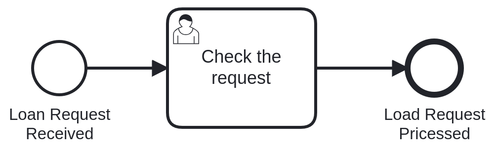

[](https://github.com/holisticon#open-source-lifecycle)
[](https://github.com/polyflow-info/polyflow-getting-started/actions/workflows/ci.yml)


## Getting Started with Polyflow

> Polyflow is a component library for building enterprise-wide process platforms with
> multiple process engines like Camunda Platform.


This repository is an example for settings and configurations to demonstrate the minimal
steps to integrate an existing process application based on Spring Boot with Polyflow.

For doing so, we used a simple example from Camunda Platform 7 - the load approval process.




Fo more information on Camunda Platform 7 with Spring Boot please check the
official [Camunda getting started](https://docs.camunda.org/get-started/spring-boot/)
guide.

## How to build

```bash
./mvnw clean package
```

## How to start

```bash
./mvnw spring-boot:run
```

## How to start from IDE

Please run the `PolyflowMinimalApplication` inside your IDE.

## Access the H2 SQL Console

Open the following address in your browser: http://localhost:8080/h2-console/, click
on `Connect` and inspect the database tables available. The `PLF_`-prefixed tables
are parts of the Polyflow View part. For example to check for currently available tasks,
execute the following SQL statement:

```sql
SELECT *
FROM PLF_TASK;
```

### License

This library is developed under

[](/LICENSE)

### Sponsors and Customers

[](https://holisticon.de/)
